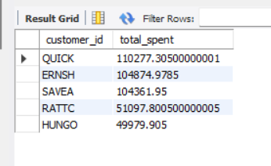

# Top 5 Customers by Order Amount - Mini Project

## Overview
This mini project uses the **Northwind sample database** to identify the **top 5 customers who have spent the most money** on orders. The goal is to practice multi-table joins, aggregation, and subqueries in SQL.

---

## Dataset
- **Database:** Northwind  
- **Tables used:** 
  - `customers` – information about customers (customer ID, company name, contact name, etc.)  
  - `orders` – order details placed by customers  
  - `order_details` – individual product lines in each order, including unit price, quantity, and discount  

---

## Project Steps

1. **Step 1: Join Customers and Orders**
   - Link each customer to their orders using `customer_id`.
   - Purpose: Understand which orders belong to which customers.

2. **Step 2: Include Order Details**
   - Join `order_details` to include `unit_price`, `quantity`, and `discount`.
   - Purpose: Prepare data to calculate order totals.

3. **Step 3: Calculate Total Amount per Order**
   - Aggregate each order’s total using:
     ```
     SUM(unit_price * quantity * (1 - discount)) AS order_total
     ```
   - Groups by `order_id` to get one total per order.

4. **Step 4: Aggregate Total Spending per Customer**
   - Use a **subquery** (`order_summary`) to calculate total per order first.
   - Outer query sums all order totals per customer to get overall spending.
   - Orders by `total_spent` descending and selects **Top 5 customers**.
   - Purpose: Identify the highest-spending customers.

---

## Output


- The table displays:
  - `customer_id` – unique customer code
  - `total_spent` – total amount spent across all orders
- Shows the **top 5 highest-spending customers**.

---

## Learning Outcomes
- Multi-table joins (`JOIN`)
- Aggregations (`SUM`, `GROUP BY`)
- Subqueries for stepwise calculations
- Understanding a real-world database schema
- Structuring a mini project for analysis
