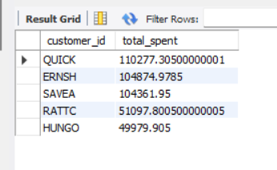

# Top 5 Customers by Order Amount - Mini Project

## Overview
This mini project uses the **Northwind sample database** to identify the **top 5 customers who have spent the most money** on orders. The goal is to practice multi-table joins, aggregation, and subqueries in SQL.

---

## Output

- The table displays:
  - `customer_id` – unique customer code
  - `total_spent` – total amount spent across all orders
- Shows the **top 5 highest-spending customers**.

---

## Learning Outcomes
- Multi-table joins (`JOIN`)
- Aggregations (`SUM`, `GROUP BY`)
- Subqueries for stepwise calculations
- Understanding a real-world database schema
- Structuring a mini project for analysis
